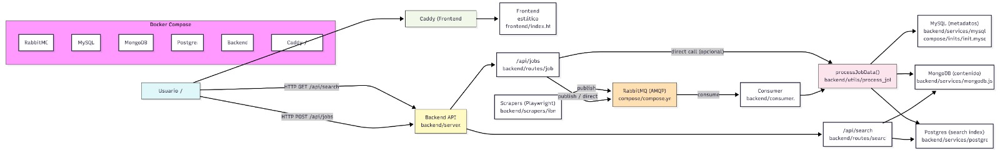

# Sistema de Búsqueda de Ofertas de Trabajo
## BDA - Proyecto #1

Sistema distribuido para scraping, almacenamiento y búsqueda de ofertas laborales utilizando múltiples bases de datos y arquitectura de microservicios.

## Equipo:
- Sebastián Bolaños Serrano <C11142>
- Oscar Quesada Webb <B96191>
- Esteban Chaves Obando <C12149>
- Sebastián Meseguer Piedra <C24819>

## Arquitectura del Sistema



## Componentes Principales

### Backend Services

**API Server (`server.js`)**
- API REST con Express.js
- Endpoints: `/api/jobs` (crear ofertas) y `/api/search` (búsqueda)
- Coordina escrituras/lecturas entre las tres bases de datos

**Consumer (`consumer.js`)**
- Consume mensajes de RabbitMQ
- Procesa y almacena ofertas en las bases de datos
- Ejecución continua en background

**Scraper (`scrapers/ibm.js`)**
- Web scraping con Playwright
- Extrae ofertas de IBM Careers
- Envía datos a RabbitMQ para procesamiento asíncrono

### Bases de Datos

**MySQL**
- Almacena metadatos de ofertas (título, URL, fecha, tipo)
- Relaciones entre ofertas y skills

**MongoDB**
- Almacena descripciones completas (documentos grandes)
- Contenido sin estructura rígida

**PostgreSQL**
- Índices de búsqueda full-text con `ts_vector`
- Ranking de relevancia con `ts_rank`

**RabbitMQ**
- Cola de mensajes para procesamiento asíncrono
- Desacopla scraper del procesamiento de datos

## Flujo de Datos

1. **Scraping**: El scraper extrae ofertas y las envía a RabbitMQ
2. **Procesamiento**: El consumer recibe mensajes y procesa las ofertas
3. **Almacenamiento**: Datos distribuidos en MySQL, MongoDB y PostgreSQL
4. **Búsqueda**: API consulta PostgreSQL para búsqueda full-text y enriquece resultados con MySQL/MongoDB

## Stack Tecnico

- **Backend**: Node.js, Express
- **Web Scraping**: Playwright
- **Bases de Datos**: MySQL, MongoDB, PostgreSQL
- **Message Queue**: RabbitMQ
- **Frontend**: Vite
- **Orquestación**: Docker Compose

## Instalación y Ejecución

### Requisitos
- Docker y Docker Compose
- Node.js 20+

### Iniciar el sistema completo

```bash
cd compose
./run-all.sh
```

### Detener servicios

```bash
cd compose
./stop-all.sh
```

### Limpiar todo

```bash
cd compose
./remove-all.sh
```

## Endpoints API

### POST /api/jobs
Crear nueva oferta de trabajo.

**Body:**
```json
{
  "title": "Software Engineer",
  "description": "Job description...",
  "country": "USA",
  "remote_type": "remoto",
  "job_type": "Full-time",
  "url": "https://...",
  "company": "IBM"
}
```

### GET /api/search?q=query
Buscar ofertas por palabras clave.

**Respuesta:**
```json
{
  "success": true,
  "data": [...],
  "total": 10
}
```

## Características Técnicas

- **Polyglot Persistence**: Cada base de datos optimizada para su caso de uso
- **Arquitectura asíncrona**: RabbitMQ para desacoplamiento
- **Full-text search**: PostgreSQL con vectores de búsqueda
- **Extracción de skills**: Procesamiento NLP básico de descripciones
- **Scraping resiliente**: Reintentos automáticos y manejo de errores

## Sobre uso de IA
Utilizamos herramientas de inteligencia digital para redactar partes de este README. En cuanto al desarrollo del proyecto, se utilizó Inteligencia Artificial para agilizar el proceso de elaboración de código repetitivo y funcionalidades básicas, evitando el uso de esta en secciones críticas de la solución, como la integración, infrastructura, etc.